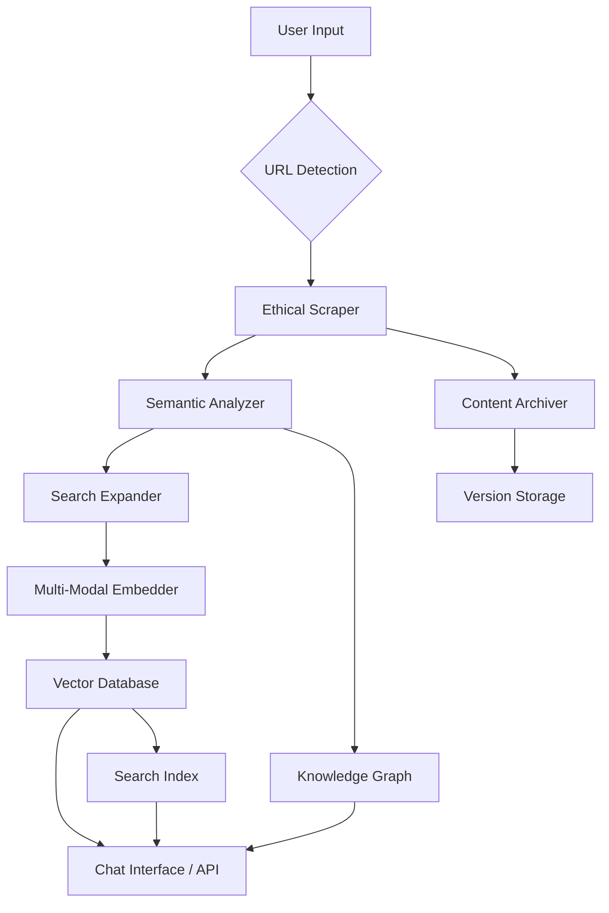

────────────────────────────────────────────────────────────────────────
## 1. EXECUTIVE SUMMARY
────────────────────────────────────────────────────────────────────────

This document outlines a comprehensive strategy for building and improving a Web Intelligence System. It integrates requirements for ethical and adaptive web scraping, multi-modal content processing, knowledge-graph-driven analysis, caching, versioning, monitoring, and search expansion. The unified focus is to ensure robust, scalable, and compliant operations that can handle dynamic websites, large volumes of requests, high performance demands, and advanced analytics. It also covers deployment, testing, and success criteria for a production-ready system.

────────────────────────────────────────────────────────────────────────
## 2. SYSTEM COMPONENTS & REQUIREMENTS
────────────────────────────────────────────────────────────────────────

2.1 Scraping & Content Acquisition
• URL Detection & Validation  
  – Automatic URL detection in user input  
  – Format validation  
  – Robots.txt compliance & dynamic access checks  
• Content Extraction 
  – Static & dynamic (JS-rendered) scraping  
  – Multi-format parsing (HTML, PDF, Doc, Media)  
  – Adaptive scraping (auto-detect if client-side rendering is required)  
• Ethical Compliance
  – Dynamic proxy rotation for high-volume scraping
  – Access validation and rate limiting
  – Custom analytics & metrics

2.2 Knowledge Graph & Analysis
• Entity Extraction
  – Named entity recognition
  – Relationship mapping
  – Graph database integration
• Semantic Analysis
  – Content quality scoring
  – Context expansion triggers
  – Entity relationship weighting
• Graph Operations
  – Query optimization
  – Path analysis
  – Dynamic updates

2.3 Multi-Modal Processing
• Text Processing
  – Cleaning and normalization
  – Language detection
  – Format conversion
• Media Analysis
  – Image/video embedding
  – Cross-modal alignment
  – Quality assessment
• Embedding Generation
  – Text vectorization
  – Media feature extraction
  – Combined representations

2.4 Infrastructure & Operations
• Storage & Caching
  – Version control for content
  – Distributed caching
  – Metadata preservation
• Monitoring & Compliance
  – Custom analytics & metrics
  – Circuit breaker patterns
  – Performance tracking
• Security & Access
  – Rate limiting
  – Authentication
  – Audit logging

────────────────────────────────────────────────────────────────────────
## 1. TECHNOLOGY STACK
────────────────────────────────────────────────────────────────────────

Below is a consolidated view of technologies chosen or recommended for each major component:

| Component                     | Technology Options                                   | Notes                                                             |
|------------------------------ |------------------------------------------------------ |------------------------------------------------------------------ |
| Scraping                      | Playwright, BrowserStack, ScraperAPI, BeautifulSoup  | Handles dynamic rendering and large-scale scraping                |
| Processing (NLP/CV)          | spaCy, Transformers, Computer Vision APIs            | Supports advanced text processing and possible image analysis     |
| Search & Expansion           | Tavily, Google CSE, SerpAPI                          | Used for retrieving additional context and expansions             |
| Vectorization (Embeddings)   | OpenAI CLIP, Azure OpenAI (text-embedding-ada-002), Google MUM, Cohere | Multi-modal embeddings for text + media                           |
| Storage & Versioning         | Azure Blob Storage + Delta Lake                      | Scalable content storage with version tracking                    |
| Caching                      | Redis Cluster + CDN Edge caching                     | Ensures low-latency deliveries for repeated requests              |
| Monitoring & Analytics       | Prometheus + Grafana + Custom Metrics                | Captures scraping analytics, performance, and error metrics       |
| Knowledge Graph              | Custom or Off-the-Shelf Graph DB (e.g., Neo4j)       | Store and query semantic relationships                            |

────────────────────────────────────────────────────────────────────────
### 2. SOLUTION ARCHITECTURE (OVERVIEW)
────────────────────────────────────────────────────────────────────────

4.1 System Components
```PYTHON
class WebIntelligenceSystem:
    def __init__(self):
        self.scraper = EthicalScraper()              # Handles dynamic + static scraping
        self.analyzer = SemanticAnalyzer()           # NLP, knowledge graph, quality scoring
        self.search_expander = TavilySearchExpander()# Context expansions
        self.vectorizer = MultiModalEmbedder()       # Multi-modal embedding generation
        self.cache = DistributedContentCache()       # Redis/Edge caching
        self.versioner = ContentArchiver()           # Handles versioning (Delta Lake, Blob)
        self.monitor = ScrapingAnalytics()           # Custom logging & metrics
        self.vector_index = VectorIndex()            # For vector-based searches
        self.search_index = SearchIndex()            # Traditional indexing for access

    async def process_url(self, url: str) -> ProcessedContent:
        """Enhanced processing pipeline with ethical checks, expansions, and indexing"""
        with self.monitor.trace(url):
            if (cached := self.cache.get(url)):
                return cached  # Return cached data if available

            access_check = await self.scraper.validate_access(url)
            if not access_check.allowed:
                raise ScrapingNotAllowedError(access_check.reason)

            # Harvest the content
            content = await self.scraper.harvest(url)
            
            # Perform semantic analysis
            analyzed = self.analyzer.process(content)
            if analyzed.quality_score < 0.7:
                expanded = await self.search_expander.expend(analyzed)
                analyzed = self.analyzer.merge_context(analyzed, expanded)
            else:
                expanded = None

            # Generate embeddings (text + media)
            vectorized = await self.vectorizer.generate(
                analyzed.clean_content,
                media=analyzed.media_assets
            )
            
            # Final processed structure
            processed = ProcessedContent(
                content=analyzed,
                embeddings=vectorized,
                search_context=expanded,
                source=ContentSource(url),
                relationships=analyzed.entity_graph
            )
            
            # Store version, set cache, and update indexes
            await asyncio.gather(
                self.versioner.store_version(processed),
                self.cache.set(url, processed),
                self._update_search_index(processed)
            )

            return processed

    async def _update_search_index(self, content):
        """Update both vector and traditional search indices"""
        await self.vector_index.upsert(content.embeddings)
        await self.search_index.add_document(content)
```

#### 4.2 Data Flow & Service Architecture

Mermaid Diagram (High-Level):


────────────────────────────────────────────────────────────────────────
## 3. IMPLEMENTATION STRATEGY
────────────────────────────────────────────────────────────────────────

Below is a consolidated, multi-phase implementation strategy. It merges high-level project phases (from the second plan) with more granular steps (from the first plan).

### PHASE 1: Core Web Intelligence (4 Weeks)
----------------------------------------------------------------------------
4. Implement EthicalScraper
   • Hybrid rendering detection (HEAD checks + BrowserStack fallback)  
   • Auto-retry with dynamic proxy rotation  
   • Robots.txt compliance engine  

5. Build SemanticAnalyzer
   • Multi-format extraction (HTML, PDF, Doc, images)  
   • Entity relationship mapping via knowledge graph  
   • Content quality scoring  

6. Configure Distributed Scraping Infrastructure
   • Docker container orchestration  
   • Multi-region capability for resilience  
   • Setup basic monitoring (Prometheus + Grafana)  

#### PHASE 2: Intelligence Augmentation (3 Weeks)
----------------------------------------------------------------------------
7. Implement Knowledge Graph Integration 
   • Expand entity & relationship model  
   • Use Neo4j or similar for semantic queries  

8. Develop Multi-Modal Embedding Pipeline 
   • Integrate image/video embeddings if required  
   • Optimize text + media embeddings with chosen vector provider  

9. Build Search Expansion Gateway
   • Connect to Tavily, Google CSE, or SerpAPI  
   • Merge expansions seamlessly into content analysis  

10. Configure Hybrid Indexing with Azure Cognitive Search
   • Combine vector-based index and traditional full-text index  

### PHASE 3: Productionization (2 Weeks)
----------------------------------------------------------------------------
11. Implement Content Versioning & Delta Tracking
   • Store snapshots in Blob + Delta Lake  
   • Provide rollback or historical view functionality  

12. Set Up Distributed Caching Layer
   • Redis cluster or equivalent  
   • Edge caching for speed improvement  

13. Configure Scraping Analytics Dashboard
    • Show request volume, proxy usage, success/failure rates  
    • Visualize content quality scores  

14. Add Circuit Breaker Patterns for External Services
    • Proxy rotation fallback for scraping  
    • Rate-limit expansions to avoid cost overrun  

### PHASE 4: Mobile Integration (1.5 Weeks)
----------------------------------------------------------------------------
15. Implement Unified Content Processing API
    • Single endpoint for mobile/desktop clients  
    • Token-based or OAuth-based authentication  

16. Add Mobile-Specific Scraping Optimizations
    • Simplified DOM retrieval & smaller pipeline  
    • Handle paywall or adaptive site design  

17. Develop Adaptive Content Preview System
    • Summaries or snippet generation for mobile screens  
    • On-demand loading of large assets  

────────────────────────────────────────────────────────────────────────
## 18. SUCCESS CRITERIA (ENHANCED)
────────────────────────────────────────────────────────────────────────

6.1 Web Intelligence Metrics
• 99% URL detection accuracy (F1 score)  
• <1s cached response time (P95)  
• 100% robots.txt compliance (audited)  
• 95% JS rendering success rate  
• <5% content quality rejection rate  
• 100ms embedding generation latency (target for short content)  

6.2 Operational Requirements
• 5-layer request fallback strategy  
• Automated proxy rotation every 10 requests  
• Multi-region scraping capabilities  
• <0.1% cache miss penalty  

6.3 Additional Performance & Quality Metrics
• URL processing time: < 2 seconds end-to-end  
• Cache hit rate: > 80%  
• API response time: < 500ms  
• Content extraction accuracy: > 95%  
• Entity recognition precision: > 90%  
• Search relevance score: > 0.8  
• System uptime: > 99.9%  

────────────────────────────────────────────────────────────────────────
## 19. TESTING REQUIREMENTS (EXPANDED)
────────────────────────────────────────────────────────────────────────

7.1 Web Intelligence Validation
• Ethical Compliance Audit (3rd party)  
• Multi-format Extraction Accuracy (HTML, PDF, images)  
• Knowledge Graph Relationship Validation  
• Search Expansion Relevance Testing  
• Cross-browser Rendering Consistency  
• Proxy Rotation & Circuit Breaker Effectiveness  

7.2 Stress Testing
• 10k RPM scraping load test  
• Embedding service failover test  
• Cache invalidation race conditions  
• Multi-page navigation edge cases  

7.3 Security Testing
• XSS/CSRF vulnerability scans  
• Data leakage prevention audit  
• TLS interception detection  
• Bot mitigation testing  

### 7.4 Unit & Integration Tests

### Example (Unit Tests):

#### `tests/test_scraper.py`
```python
def test_url_validation():
    scraper = EthicalScraper()
    assert scraper._validate_url("https://example.com")
    assert not scraper._validate_url("invalid-url")
```
---
#### `tests/test_processor.py`
```python
def test_entity_extraction():
    processor = SemanticAnalyzer()
    result = processor.process("Microsoft announced new AI features")
    assert "Microsoft" in [e.text for e in result["entities"]]
```
---
### Example (Integration Test):

#### `tests/test_integration.py`
```python
async def test_full_pipeline():
    system = WebIntelligenceSystem()
    result = await system.process_url("https://example.com")
    assert result.content is not None
    assert result.embeddings is not None
    assert result.source.url == "https://example.com"
```
────────────────────────────────────────────────────────────────────────
20. CODE IMPLEMENTATION (ILLUSTRATIVE EXCERPTS)
────────────────────────────────────────────────────────────────────────

Below are sample code listings illustrating core system components. In a typical repository, these would be separated into modules (scraping, analysis, embedding, storage, etc.).

### 8.1 Ethical Scraper

#### `scraping/ethical_scraper.py`
```python
import httpx
from bs4 import BeautifulSoup

class EthicalScraper:
    def __init__(self):
        self.client = httpx.AsyncClient()
        self.monitor = ScrapingAnalytics()  # Custom analytics

    async def validate_access(self, url: str):
        # Check robots.txt, use HEAD request to confirm accessible
        # Return an object with allowed: bool and reason: str
        ...
    
    async def harvest(self, url: str) -> str:
        response = await self.client.get(url)
        if response.status_code == 200:
            return response.text
        else:
            self.monitor.log_error(url, f"HTTP {response.status_code}")
            return ""
```
---
### 8.2 Semantic Analyzer

#### `analysis/semantic_analyzer.py`
```python
import spacy

class SemanticAnalyzer:
    def __init__(self):
        self.nlp = spacy.load("en_core_web_sm")

    def process(self, content: str):
        doc = self.nlp(content)
        quality_score = self._score_quality(doc)
        return AnalyzedContent(
            clean_content=content,
            entities=self._extract_entities(doc),
            entity_graph=self._map_relationships(doc),
            media_assets=[],
            quality_score=quality_score
        )
```
---

### 8.3 Multi-Modal Embedder

#### `embeddings/multimodal_embedder.py`
```python
class MultiModalEmbedder:
    def __init__(self):
        self.client = AzureOpenAI(
            api_key=os.getenv("AZURE_OPENAI_KEY")
        )

    async def generate(self, text: str, media: list = None):
        # This can combine text embeddings with image/video embeddings
        text_vector = await self._get_text_embeddings(text)
        media_vectors = [await self._get_media_embeddings(m) for m in (media or [])]
        return {
            "text_embedding": text_vector,
            "media_embeddings": media_vectors
        }
```

────────────────────────────────────────────────────────────────────────
21. DEPLOYMENT GUIDELINES
────────────────────────────────────────────────────────────────────────

9.1 Environment Setup
• Install dependencies: pip install -r requirements.txt  
• Set environment variables (e.g., AZURE_STORAGE_CONN_STRING, AZURE_OPENAI_KEY, REDIS_HOST, etc.)  
• Run Redis or connect to Redis cluster: docker run -d -p 6379:6379 redis:alpine  
• Configure Azure resources (Blob Storage, Cognitive Search, etc.)  

9.2 Deployment Steps
22. Set up infrastructure (Azure, Docker, Kubernetes as needed)  
23. Configure Redis for caching (cluster if high availability is required)  
24. Deploy application code  
25. Run database/storage migrations (if any)  
26. Configure monitoring & logging (Prometheus, Grafana)  
27. Validate system with end-to-end tests  
28. Enable production traffic gradually (canary deployment or blue-green)  

────────────────────────────────────────────────────────────────────────
29. NEXT STEPS
────────────────────────────────────────────────────────────────────────

30. Review and confirm technology choices with stakeholders.  
31. Finalize architecture diagrams and confirm resource allocation (computing, storage).  
32. Begin Phase 1 (Core Web Intelligence) implementation, focusing on EthicalScraper and SemanticAnalyzer.  
33. Set up weekly or bi-weekly progress reviews to ensure alignment.  
34. Plan for scaling and optimization as usage grows, including potential migration to multi-region or more advanced caching strategies.  

────────────────────────────────────────────────────────────────────────

